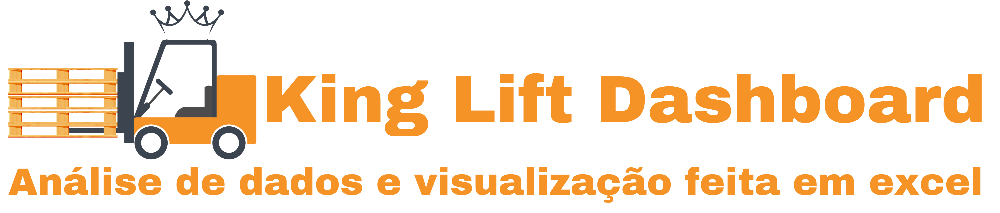

# 📊 King Lift Dashboard

## 📝 Descrição do Projeto
O **King Lift Dashboard** é um projeto desenvolvido em Microsoft Excel para análise e visualização de dados financeiros da King Lift, uma empresa de locação de empilhadeiras. Este projeto demonstra habilidades avançadas em análise de dados, modelagem e visualização.. Ele foi projetado para proporcionar insights valiosos que ajudam a empresa a aumentar seu faturamento e melhorar a eficiência operacional.

## 🗂️ Estrutura do Repositório
Este repositório está organizado da seguinte forma:
- **01_Base_de_Dados**: Contém os arquivos de dados brutos utilizados para análise, incluindo detalhes de faturamento, clientes e equipamentos.
- **02_Dashboard**: Contém o arquivo do dashboard em Excel, pronto para uso.
- **03_Recursos**: Contém recursos utilizados no projeto.

## 💾 Demonstração e Uso
Para usar o dashboard:
1. **Download do Arquivo**: [Clique aqui para baixar o arquivo Excel](https://github.com/tnleite/projeto_king_lift/raw/main/02_Dashboard/dashboard_king_lift.xlsx).
2. **Instruções de Uso**: 
   - Abra o arquivo no Excel.
   - No menu Dashboard Utilize os filtros interativos no painel de controle para segmentar as informações desejadas, consulte os gráficos e tabelas dinâmicas para obter insights detalhados.
   - No menu Dados consulte as informações que basearam o nosso dashboard. Ele possui filtros para que possa ser gerado relatórios conforme a necessidade dos interessados.
   - No menu Dinâmicas veja, de forma estruturada, todas as fórmulas utilizadas e que dão embasamento passa os gráficos interativos do dashboard.
   - No menu contato estão os contatos para suporte do produto.

## 📖 Artigo Completo
Para uma análise detalhada do projeto, incluindo metodologias e insights obtidos, leia o [artigo completo](https://medium.com/@thiago.leit/king-lift-dashboard-c823dc3fcc56).

## 🏗️ Arquitetura dos Dados

O fluxo de dados no projeto segue a seguinte estrutura:

1. **Arquivos Excel**: Dados brutos de faturamento, clientes e equipamentos são armazenados em arquivos Excel.
2. **Power Query**: Utilizado para combinar, limpar e transformar os dados.
3. **Power Pivot**: Criação de um modelo de dados relacional eficiente para análise.
4. **Dashboard Excel**: Desenvolvimento de gráficos interativos e tabelas dinâmicas para visualização dos dados.

## 🛠️ Tecnologias Utilizadas
- [Microsoft Excel](https://www.microsoft.com/en-us/microsoft-365/excel)
- [Power Query](https://docs.microsoft.com/en-us/power-query/power-query-what-is-power-query)
- [Power Pivot](https://support.microsoft.com/en-us/excel)

## 🔄 Etapas do Projeto
1. **Extração e Transformação de Dados**: Utilização do Power Query para combinar e limpar dados de faturamento mensal, clientes e equipamentos. *Habilidades: Limpeza e transformação de dados.*
2. **Modelagem de Dados**: Criação de um modelo de dados relacional eficiente com Power Pivot. *Habilidades: Modelagem de dados, uso de DAX.*
3. **Análise e Visualização**: Desenvolvimento de tabelas dinâmicas e gráficos interativos para responder a perguntas críticas de negócios. *Habilidades: Visualização de dados, storytelling.*
4. **Desenvolvimento do Dashboard**: Criação de um dashboard interativo em Excel para facilitar a obtenção de insights. *Habilidades: Design de dashboard, interatividade.*
5. **Segurança dos Dados**: Implementação de medidas para proteger a integridade e confidencialidade dos dados. *Habilidades: Segurança de dados.*

## 📈 Impacto e Resultados
- Identificação dos equipamentos e clientes que mais contribuem para o faturamento.
- Análise da distribuição do faturamento por tipo de equipamento e contrato.
- Avaliação do crescimento das locações e da quantidade de clientes com equipamentos locados.
- **Resultados Quantificáveis**: Aumento de 60% no faturamento devido à estratégia de eliminação de intermediários.

## 🖼️ Screenshots
Aqui estão algumas capturas de tela do dashboard:
- 
  *Exemplo de análise de faturamento por tipo de equipamento.*
- 
  *Distribuição de clientes por região.*
  
## 📞 Contato
- 📫 Você pode entrar em contato comigo pelo meu [e-mail](mailto:thiago.leit@hotmail.com).
- 💼 Meu perfil no [LinkedIn](https://www.linkedin.com/in/tnleite/) para acompanhar meu progresso e projetos.
- ✍🏻 Meu perfil no [Medium](https://medium.com/@thiago.leit) para ver artigos publicados.
- 🌐 Meu [Portfólio](https://thiagoleite.my.canva.site/) para visualizar outros projetos.

